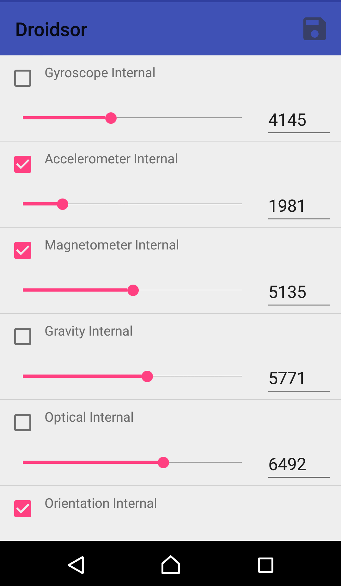
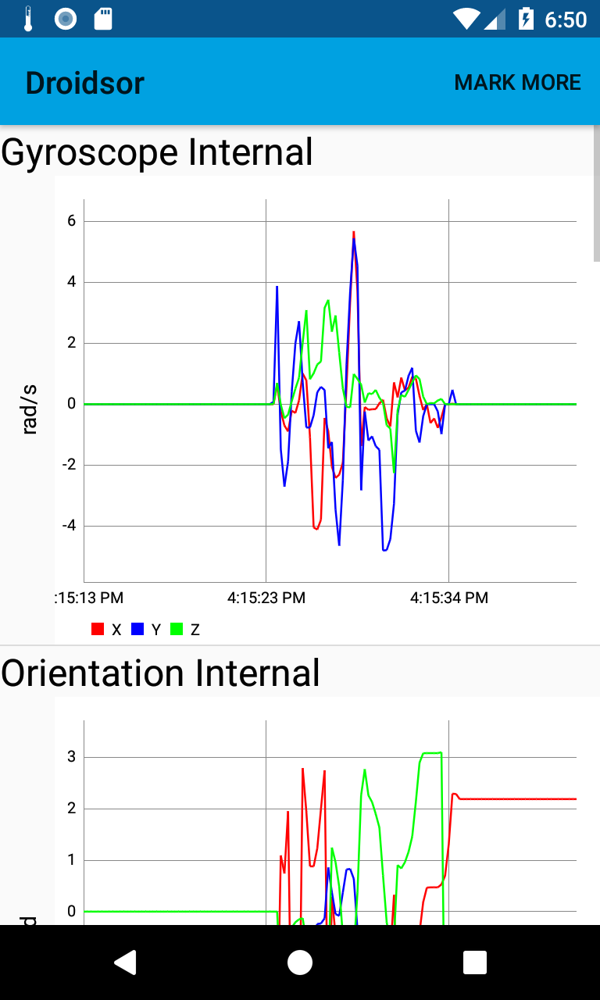

# Droidsor
Aplikace pro snímání dat ze senzorů na Androidu. Umožňuje připojit Bluetooth zařízení TI SensorTag CC2650 a snímat data i z tohoto senzoru. Data jsou uložena v SQLite databázi, s možností exportu do GPX formátu. Pro snadnější obsluhu snímání senzorů je možno využít profilů, ve kterých uživatel uvede, které senzonry chce snímat a s jakou frekvencí je chce snímat. Snímat se dá i bez profilu. Data ze snímaní lze v aplikaci zobrazit ve formě grafu.
## Požadavky
Android 4.4 až Android 6.0 (Na vyšších verzích nebylo testováno)
SensorTag CC2650 (Pokud chce uživatel připojit zařízení Bluetooth)

## Ukázky z aplikace

Přehled senzorů |  Nastavení profilů | Graf 
:-------------------------:|:-------------------------:|:-------------------------:
    | 
  | 
  