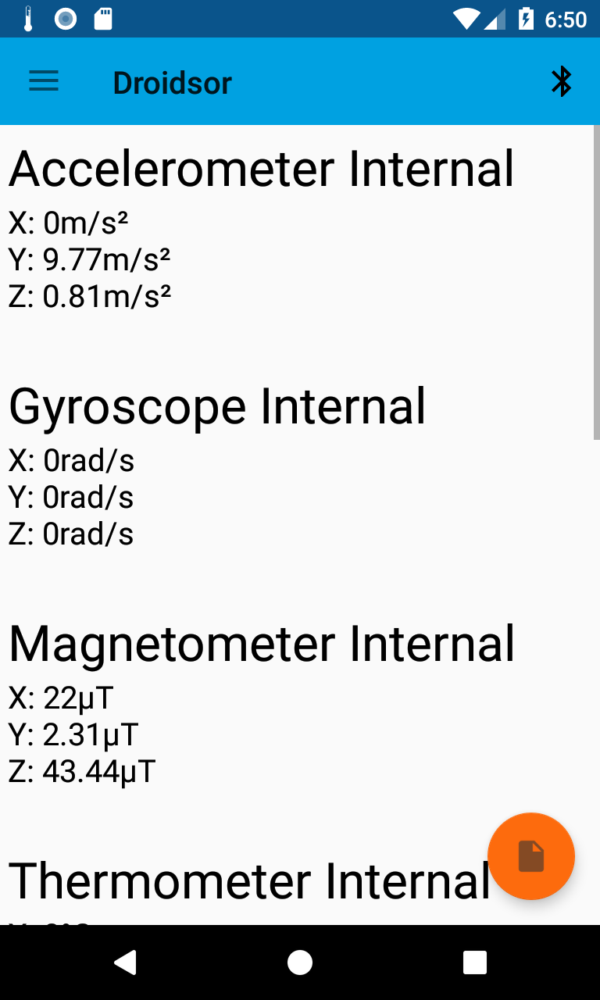
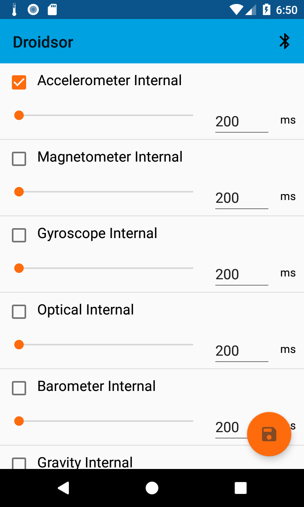

# Droidsor
Application designed for capturing sensor data on Android. It allows to connect to Bluetooth device TI SensorTag CC2650 and capture data from this sensor too. Data are saved in SQLite database with an option to export to GPX file format. For easier sensor data recording it is possible to use profiles in which user can set sensors that he wants to capture and at what frequency. It is possible to display recorded data via charts. 

## Requirements
Android 4.4 and higher
SensorTag CC2650 (If user wants to connect Bluetooth device)  

## Installation
You can [download](https://play.google.com/store/apps/details?id=com.marekulip.droidsor) this app from Google Play App Store or you can use [apk file](https://github.com/MarekUlip/Droidsor/blob/master/app/release/Droidsor.apk).

## Ukázky z aplikace

Sensor overview |  Profile settings | Charts 
:-------------------------:|:-------------------------:|:-------------------------:
    |   |   